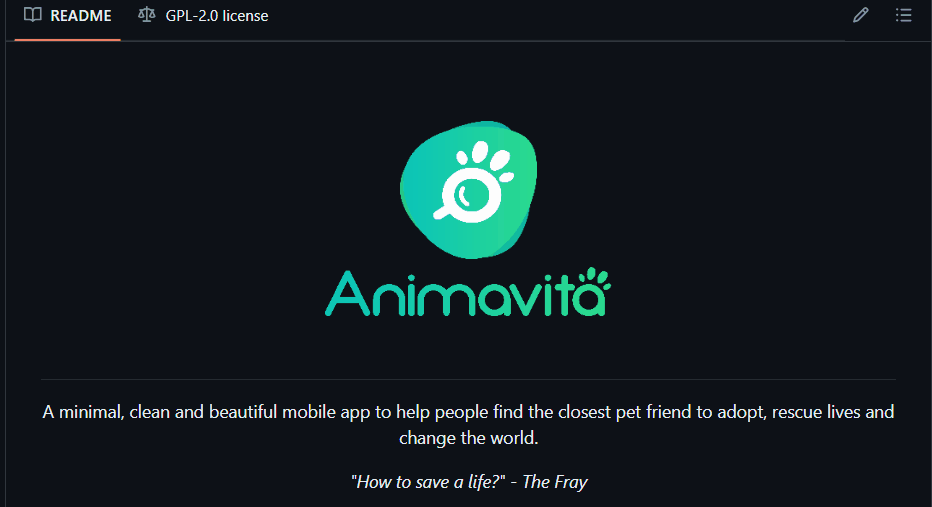

# Projeto com README
Um projeto de teste com um arquivo com README 🚀
[]

## Tecnologia ultilizadas
- HTML
- CSS
- JS

## Como ultilizar

Clone o arquivo 
```
Git Clone <url>
```
Acesse a pasta do projeto
```
cd repositorio-com-readme
